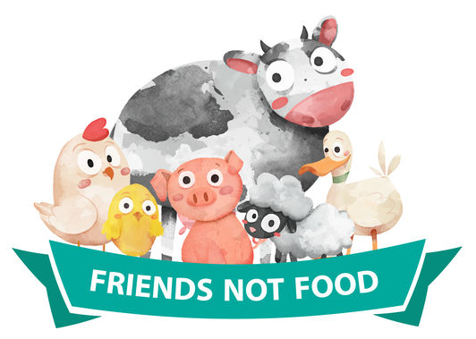

  
  <h1>Vegan Cheathseet!</h1>

  <h4>
    <a href="README.md">Vegan Cheatsheet</a>
     | 
    <a href="Important-Studies.md">Important Studies</a>
     | 
    <a href="Books.md">Books</a>
     | 
    <a href="Podcasts.md">Podcast</a>
     | 
    <a href="FAQ.md">FAQ</a>
  </h4>

# Vegan Cheatsheet

## Table of Contents
1. [🐮 Vegan Documentaries & Films](#-vegan-documentaries-films)
2. [🐱 Vegan Inspirational Speeches](#-vegan-inspirational-speeches)
3. [🐋 Must Read Books on Veganism](#-must-read-books-on-veganism)
4. [🦋 Arguments against Veganism Debunked](#-arguments-against-veganism-debunked)
5. [🐼 Burnout / Emotional Support](#-burnout-emotional-support)
6. [🦄 Vegans of Color](#-vegans-of-color)
7. [🐯 Vegan Reddit Communites](#-vegan-reddit-communites)
8. [🐢 Vegan Health & Nutrition](#-vegan-health-nutrition)
9. [🐗 Eating out as a Vegan](#-eating-out-as-a-vegan)
10. [🍅 Great links for Vegan Recipes](#-great-links-for-vegan-recipes)
11. [🐀 Random / Uncategorized Links](#-random-uncategorized-links)
12. [🐦 Protein Myths Debunked](#-protein-myths-debunked)
13. [🐏 Random Links to help Activists](#-random-links-to-help-activists)
14. [🐰 Online & Local Vegan Activism Organizations](#-online-local-vegan-activism-organizations)
15. [🐥 Veganism Health Consensus](#-veganism-health-consensus)
16. [🐎 Awesome Activists to Follow](#-awesome-activists-to-follow)
17. [🐍 Notable Vegan Celebrities](#-notable-vegan-celebrities)
18. [🦃 Environmental Statistics of Animal Agriculture](#-environmental-statistics-of-animal-agriculture)
19. [🦍 Random studies/news released on Veganism](#-random-studiesnews-released-on-veganism)
20. [🦍 iOS / Android Usefull Vegan Apps](#-ios-android-usefull-vegan-apps)
21. [🐵 Vegan Challenges](#-vegan-challenges)
22. [🐞 Easy Access Resources](#-easy-access-resources)
23. [🐎 Resources for new Vegans](#-resources-for-new-vegans)
24. [🦔 Vegan Video Playlists](#-vegan-video-playlists)
25. [🍆 Vegan Cookbooks on Amazon](#-vegan-cookbooks-on-amazon)
26. [🐟 Level 5 Veganism](#-level-5-veganism)
27. [🐜 Easy Guide For Vegan Nutrition](#-easy-guide-for-vegan-nutrition)
28. [🦔 Published studies on the health of Soy](#-published-studies-on-the-health-of-soy)
29. [🦇 Discord Communities](#-discord-communities)
30. [🏆 Credits](#-credits)

## 🐮 Vegan Documentaries & Films
- 🐮 [⭐️ Dominion (2018)](https://www.youtube.com/watch?v=ny6aqdFy9SI)
- 🌍 [Cowspiracy (2014)](https://www.netflix.com/watch/80033772)
- 🌱 [What The Health (2017)](https://www.netflix.com/nl-en/title/80174177)
- 🌱 [Forks Over Knives (2011)](https://www.netflix.com/nl-en/title/70185045)
- 🐮 [Land of Hope and Glory (2017)](https://www.youtube.com/watch?v=dvtVkNofcq8)
- 🐮 [Meet Your Meat (2012)](https://www.peta.org/videos/meet-your-meat/)
- 🐮 [Speciesism: The Movie (2013)](https://speciesismthemovie.com/)
- 🐮 [Earthlings (2005)](https://www.youtube.com/watch?v=BrlBSuuy50Y)
- 🏋️ [The Game Changers (2019)](https://gamechangersmovie.com)

## 🐱 Vegan Inspirational Speeches
- [⭐️ Best Speech You Will Ever Hear (Gary Yourofsky)](https://youtu.be/es6U00LMmC4?t=109)
- [You Will Never Look at Your Life in the Same Way Again (Earthling Ed)](https://www.youtube.com/watch?v=Z3u7hXpOm58)
- [This Man Makes You Think (James Wildman)](https://www.youtube.com/watch?v=E7JE8j5Ncmw)
- [Why It's Time To Go Vegan | Alex O'Connor](https://www.youtube.com/watch?v=gcVR2OVxPYw)

## 🐋 Must Read Books on Veganism
- [⭐️ Why We Love Dogs, Eat Pigs, and Wear Cows - Melanie Joy](https://www.amazon.com/Love-Dogs-Pigs-Wear-Cows/dp/B008B0PQZU)
- [Animal Equality - Joan Dunayer](http://www.amazon.com/Animal-Equality-Liberation-Joan-Dunayer/dp/0970647557/ref=sr_1_1?ie=UTF8&qid=1430720484&sr=8-1&keywords=Animal+Equality%3A+Language+and+Liberation)
- [Animal Liberation - Peter Singer](https://www.amazon.com/Animal-Liberation-Definitive-Classic-Movement/dp/B017JBUOXK/ref=sr_1_1?keywords=Animal+Liberation+Peter+Singer&qid=1561908379&s=audible&sr=1-1)
- [How Not To Die - Michael Greger](https://www.amazon.com/How-Not-Die-Discover-Scientifically/dp/B016CME5B4/ref=sr_1_1?keywords=How+Not+To+Die+Michael+Greger&qid=1561908398&s=audible&sr=1-1)
- [⭐️ The Animal Activist's Handbook - Matt Ball and Brice Friedrich](https://www.amazon.com/Animal-Activists-Handbook-Maximizing-Positive/dp/B072W8QXFZ/ref=sr_1_1?keywords=The+Animal+Activist%27s+Handbook&qid=1561908363&s=audible&sr=1-1)
- [Bleating Hearts - Mark Hawthorne](http://www.amazon.com/Bleating-Hearts-Hidden-Animal-Suffering/dp/1780998511)
- [Eating Animals - Jonathan Safran Foer](http://www.amazon.com/Eating-Animals-Jonathan-Safran-Foer/dp/0316069884/ref=sr_1_1?s=books&ie=UTF8&qid=1430719165&sr=1-1&keywords=eating+animals)
- [Farm Sanctuary - Gene Baur](http://www.amazon.com/Farm-Sanctuary-Changing-Hearts-Animals/dp/B002SB8QAU/ref=sr_1_1?ie=UTF8&qid=1369941473&sr=8-1&keywords=farm+sanctuary)
- [Veganomics - Nick Cooney](http://www.amazon.com/Veganomics-Surprising-Motivates-Vegetarians-Breakfast-ebook/dp/B00EVYZNVW)
- [Green is the New Red - Will Potter](http://www.amazon.com/Green-New-Red-Insiders-Movement/dp/087286538X)
- [Every Twelve Seconds: Industrialized Slaughter and the Politics of Sight - Timothy Pachirat](https://www.amazon.com/Every-Twelve-Seconds-Industrialized-Slaughter/dp/0300152671)

## 🦋 Arguments against Veganism Debunked
- [Can You Love Animals and Eat Them?](https://www.youtube.com/watch?v=7mjVwVDDI8E&list=PL03LZR09P2gQJyBgHk_XE8gbj8j9uFs8G)
- [It's My Personal Choice To Eat Animals!](https://www.youtube.com/watch?v=LseSfTA1BMw&list=PL03LZR09P2gQJyBgHk_XE8gbj8j9uFs8G&index=2)
- [I Love How Animals Taste!](https://www.youtube.com/watch?v=w7sn6gyxMvE&list=PL03LZR09P2gQJyBgHk_XE8gbj8j9uFs8G&index=3)
- [Animals Eat Other Animals](https://www.youtube.com/watch?v=lyQyI280YEo&list=PL03LZR09P2gQJyBgHk_XE8gbj8j9uFs8G&index=4)
- [Veganism Is Unhealthy](https://www.youtube.com/watch?v=XOI6FbEE5Jc&list=PL03LZR09P2gQJyBgHk_XE8gbj8j9uFs8G&index=5)
- [It's Cultural and Traditional to Eat Animals](https://www.youtube.com/watch?v=0tItNLwMT_g&list=PL03LZR09P2gQJyBgHk_XE8gbj8j9uFs8G&index=6)
- [Our Ancestors Ate Animals](https://www.youtube.com/watch?v=YJtSoZPgaz0&list=PL03LZR09P2gQJyBgHk_XE8gbj8j9uFs8G&index=7)
- [If the World Went Vegan, What Would Happen to the Animals?](https://www.youtube.com/watch?v=1M1fKxjlLV4&list=PL03LZR09P2gQJyBgHk_XE8gbj8j9uFs8G&index=8)
- [Human Rights Issues are More Important Than Veganism](https://www.youtube.com/watch?v=G66fBppXw4I&list=PL03LZR09P2gQJyBgHk_XE8gbj8j9uFs8G&index=9)
- [Plants Feel Pain](https://www.youtube.com/watch?v=EqUFqaeZA2g&list=PL03LZR09P2gQJyBgHk_XE8gbj8j9uFs8G&index=10)
- [Do Animals Feel Pain?](https://www.youtube.com/watch?v=nIP5Yrqdugc&list=PL03LZR09P2gQJyBgHk_XE8gbj8j9uFs8G&index=11)
- [Humans Are at the Top of the Food Chain](https://www.youtube.com/watch?v=-truOzeWBR8&list=PL03LZR09P2gQJyBgHk_XE8gbj8j9uFs8G&index=12)
- [We Are More Intelligent Than Animals](https://www.youtube.com/watch?v=-6qhtS5moFM&list=PL03LZR09P2gQJyBgHk_XE8gbj8j9uFs8G&index=13)
- [Why Farmed Animals Should be Grateful](https://www.youtube.com/watch?v=pueLyA1lIcA&list=PL03LZR09P2gQJyBgHk_XE8gbj8j9uFs8G&index=14)
- [Can't We Just Improve the Welfare of Animals?](https://www.youtube.com/watch?v=02GNr5DnPCk&list=PL03LZR09P2gQJyBgHk_XE8gbj8j9uFs8G&index=15)
- [Morality is Subjective](https://www.youtube.com/watch?v=xG4CHQdrSpc&list=PL03LZR09P2gQJyBgHk_XE8gbj8j9uFs8G&index=16)
- [Everything in Moderation](https://www.youtube.com/watch?v=Z-S21l0Xa_s&list=PL03LZR09P2gQJyBgHk_XE8gbj8j9uFs8G&index=17)
- [You Can't Be 100% Vegan](https://www.youtube.com/watch?v=1nDCx8AdZKI&list=PL03LZR09P2gQJyBgHk_XE8gbj8j9uFs8G&index=18)
- [What if a Vegan Was Stranded on a Desert Island?](https://www.youtube.com/watch?v=eqAiCOzHAPY&list=PL03LZR09P2gQJyBgHk_XE8gbj8j9uFs8G&index=19)
- [Being Vegetarian is Enough](https://www.youtube.com/watch?v=uWna6-niYEg&list=PL03LZR09P2gQJyBgHk_XE8gbj8j9uFs8G&index=20)
- [Hitler Was a Vegetarian/I Once Met a Mean Vegan](https://www.youtube.com/watch?v=8rzdZqjCDdo&list=PL03LZR09P2gQJyBgHk_XE8gbj8j9uFs8G&index=21)
- [What About Farmer's Jobs?](https://www.youtube.com/watch?v=l3-OxcOlMJ0&list=PL03LZR09P2gQJyBgHk_XE8gbj8j9uFs8G&index=22)
- [Eating Animals is the Circle of Life](https://www.youtube.com/watch?v=iL5M6Kc27SU&list=PL03LZR09P2gQJyBgHk_XE8gbj8j9uFs8G&index=23)
- [Animals Are Bred to be Killed](https://www.youtube.com/watch?v=_L84EXgRVhY&list=PL03LZR09P2gQJyBgHk_XE8gbj8j9uFs8G&index=24)
- [Soya Farming is Destroying the Environment](https://www.youtube.com/watch?v=SzOeOfNFpts&list=PL03LZR09P2gQJyBgHk_XE8gbj8j9uFs8G&index=25)
- [Going Vegan is Expensive and Restrictive](https://www.youtube.com/watch?v=Vs_nXVmyP1E&list=PL03LZR09P2gQJyBgHk_XE8gbj8j9uFs8G&index=26)
- [We're Omnivores/We Have Canine Teeth](https://www.youtube.com/watch?v=Hq23d8aI5LE&list=PL03LZR09P2gQJyBgHk_XE8gbj8j9uFs8G&index=27)
- [My Friends and Family Will Judge me if I go Vegan](https://www.youtube.com/watch?v=oSlm3-7uriM&list=PL03LZR09P2gQJyBgHk_XE8gbj8j9uFs8G&index=28)
- [God Says That I Can Eat Animals](https://www.youtube.com/watch?v=2-R1yJeFtHE&list=PL03LZR09P2gQJyBgHk_XE8gbj8j9uFs8G&index=29)
- [One Person Can't Make a Difference](https://www.youtube.com/watch?v=d6fG1my3SFg&list=PL03LZR09P2gQJyBgHk_XE8gbj8j9uFs8G&index=30)

## 🐼 Burnout / Emotional Support
📝 = Blog, 🔗 = Resources, ✏️ = Forum, 📚 = PDF

- 📝 [Self Care As An Activist](https://www.vegansociety.com/whats-new/blog/self-care-vegan-activist)
- 📝 [How To Avoid Activist Burnout](https://www.vegansociety.com/my-account/the-vegan/issue-2-2018/how-avoid-activist-burnout)
- 📝 [How Animal Lovers Avoid Getting Totally Depressed](https://www.thedodo.com/how-animal-advocates-avoid-getting-totally-depressed-1240500528.html)
- 🔗 [Depression Hotline (U.S.)](https://www.psychguides.com/hotlines/depression/)
- 🔗 [Depression Hotline (International)](https://togetherweare-strong.tumblr.com/helpline)
- ✏️ [Make A Post On /r/Vegan](https://www.reddit.com/r/vegan/)
- 📚 [Self-Care Assessment PDF worksheet](http://socialwork.buffalo.edu/content/dam/socialwork/home/self-care-kit/self-care-assessment.pdf)
- 📚 [Sustainable Activism and Avoiding Burnout](https://www.activist-trauma.net/assets/files/burnout_flyer_rightway.pdf)
- 🔗 [Compassion Fatigue Awareness Project](http://www.compassionfatigue.org/)
- 🔗 [Compassion Fatigue Resources List by Jessica Dolce](http://jessicadolce.com/resources)
- 📚 [Aftershock: Confronting Trauma in a Violent World: A Guide for Activists and Their Allies](https://www.amazon.com/Aftershock-Confronting-Violent-Activists-Flashpoint/dp/1590561031/ref=sr_1_1?s=books&ie=UTF8&qid=1473000992&sr=1-1&keywords=aftershock+pattrice+jones)
- 📚 [Trauma Stewardship: An Everyday Guide to Caring for Self While Caring for Others](https://www.amazon.com/Trauma-Stewardship-Everyday-Caring-Others/dp/157675944X/ref=sr_1_3?s=books&ie=UTF8&qid=1473001191&sr=1-3&keywords=compassion+fatigue)
- 📝 [What every vegan should know about burnout](https://www.havegonevegan.com/2016/09/what-every-vegan-should-know-about-burnout.html)
- 🔗 [Sustainable Activism](https://www.idausa.org/campaign/sustainable-activism/ )
- 🔗 [Animal Activist Support Line](https://www.idausa.org/campaign/sustainable-activism/animal-activist-helpline/)

## 🦄 Vegans of Color
- [Veganism of Color](http://www.veganismofcolor.com/)
- [The Vegan Race Wars](https://www.thrillist.com/eat/nation/vegan-race-wars-white-veganism)
- [Making Veganism more accessible](https://wearyourvoicemag.com/culture/white-vegans-accessibility-poc)

## 🐯 Vegan Reddit Communites
- [⭐️ /r/Vegan](https://www.reddit.com/r/vegan)
- [/r/VeganRecipes](https://www.reddit.com/r/veganrecipes)
- [/r/VeganFitness](https://www.reddit.com/r/veganfitness)
- [/r/DebateAVegan](https://www.reddit.com/r/debateavegan)
- [⭐️ /r/VeganActivism](https://www.reddit.com/r/VeganActivism)
- [/r/ZeroWasteVegans](https://www.reddit.com/r/ZeroWasteVegans)
- [/r/VeganFoodPorn](https://www.reddit.com/r/VeganFoodPorn)
- [/r/VeganBaking](https://www.reddit.com/r/VeganBaking)

## 🐢 Vegan Health & Nutrition
- [Vegan Health](https://veganhealth.org)
- [⭐️ Nutrition Facts](https://nutritionfacts.org)
- [Vegan.com Guide](https://www.vegan.com/nutrition)
- [Vegan Society Nutrition](https://www.vegansociety.com/resources/nutrition-and-health/nutrition-overview)

## 🐗 Eating out as a Vegan
🔍 = Search, 📖 = Information

- 🔍 [⭐️ Happy Cow](https://www.happycow.net)
- 🔍 [Google Maps](https://www.google.com/maps/search/vegan+restaurants)
- 🔍 [Yelp Search](https://www.yelp.com/search?find_desc=vegan+food)
- 📖 [Eating Out Tips](https://veganuary.com/starter-kit/vegan-eating-out-tips)
- 📖 [Fast Food Guide](https://chooseveg.com/blog/here-are-14-delicious-vegan-options-at-your)
- 🔍 [Vanilla Bean](https://www.vanilla-bean.com)

## 🍅 Great links for Vegan Recipes
📝 = Page, 📺 = Video, 🏛️ = Community

- 🏛️ [/r/VeganRecipes](https://www.reddit.com/r/veganrecipes)
- 📺 [Easy Vegan Channel](https://www.youtube.com/channel/UCSC8SLylGt1v6lbrutdH9Bw/videos)
- 📺 [Cheap Lazy Vegan](https://www.youtube.com/channel/UCEjkioV3LO_OIUaSWRxFZ3A/videos?view=0&sort=p&flow=grid)
- 📝 [Vegan Society Recipes](https://www.vegansociety.com/resources/recipes)
- 📝 [Veganuary Recipes](https://veganuary.com/recipes)
- 📝 [The Vegan Corner](https://www.youtube.com/user/thevegancorner)
- 📝 [Vegan Richa](https://www.veganricha.com/recipes)
- 📝 [Olives for Dinner](https://olivesfordinner.com/recipe-index)
- 📝 [The Vegan 8](https://thevegan8.com/recipe-index)
- 📝 [Hell Yeah It's Vegan](http://hellyeahitsvegan.com)
- 📝 [Keepin it Kind](http://keepinitkind.com/recipes)
- 📝 [Eat Figs Not Pigs](http://www.eatfigsnotpigs.com/recipes-3)

## 🐀 Random / Uncategorized Links
- [Plant Based News](https://www.plantbasednews.org)
- [Badass Vegan](https://badassvegan.com)
- [The Vegan Society](https://www.vegansociety.com)
- [Your Vegan Fallacy Is](https://yourveganfallacyis.com)
- [My Vegan Tree](https://myvegantree.org)
- [Vegan Playlist](https://veganplaylist.org)
- [You Are Their Voice](https://youaretheirvoice.com)
- [Veg News](https://vegnews.com)
- [Double Check Vegan](https://doublecheckvegan.com/)
- [Vegan Beer & Liquor](http://www.barnivore.com)
- [Best Place to Donate](https://animalcharityevaluators.org/donate)
- [/r/Vegan Infographics](https://www.reddit.com/r/vegan/wiki/infographics)
- [Vegan Clothes & Apparel](https://www.reddit.com/r/vegan/wiki/clothes-and-apparels)
- [Factory Farm Map](https://www.factoryfarmmap.org)
- [Local /r/Vegan Subs](https://www.reddit.com/r/vegan/wiki/localvegansubreddits)
- [Random Vegan Subs](https://www.reddit.com/r/vegan/wiki/relatedsubreddits)
- [U.S. Farm Subsidies Database](https://farm.ewg.org)
- [Consider Veganism](http://considerveganism.com/info)
- [Reducing Suffering](https://reducing-suffering.org)
- [Vegan Statistics](https://www.vegansociety.com/news/media/statistics)
- [Google Trends](https://trends.google.com/trends/explore?q=vegan)
- [Farm Sanctuaries List](https://www.vegan.com/sanctuaries)
- [Consider The Egg](https://considertheegg.org)
- [Carnism Debunked](https://www.carnismdebunked.com)
- [Sacred Scrible: Stencils](http://www.sacredscribble.com)
- [Discover Vegan Cheese](http://www.vegancheese.co/discover)
- [Vegan Meal Delivery](https://www.vegmealdelivery.com)
- [Vegan Dog Co](http://vegandog.co/food)

## 🐦 Protein Myths Debunked
- [Busting the Myth of Incomplete Plant-Based Proteins](https://medium.com/@chanapdavis/busting-the-myth-of-incomplete-plant-based-proteins-960428e7e91e)
- [Vegetarian Protein Is Just As 'Complete' As Meat, Despite What We've Been Taught](https://www.huffpost.com/entry/vegetarian-protein-complete-meat_n_5a90357ae4b01e9e56bb3224)
- [The Myth of Complementary Protein](https://www.forksoverknives.com/the-myth-of-complementary-protein/#gs.mrxppr)
- [PCMR: The Protein Myth](https://www.pcrm.org/news/protein-myth)
- [Strong On A Vegan Diet: Smashing Protein Myths](https://www.plantbasednews.org/post/strong-on-vegan-diet-smashing-protein-myths)
- [Protein Myth Fact Sheet](https://www.vivahealth.org.uk/resources/protein-myth-fact-sheet)

## 🐏 Random Links to help Activists
- [Vegan Activism Organizations](https://veganactivism.org)
- [Etsy Activism Stickers](https://www.etsy.com/market/vegan_activism_stickers)
- [Vegan Activism Community](https://reddit.com/r/VeganActivism)
- [Reddit Activism Guide](https://veganactivism.org/pages/reddit-activism)
- [Vegan.com Activism Guide](https://www.vegan.com/activism)
- [Vegan Activism Discord](https://discord.gg/MFzRHe5)
- [More Activism Stickers](https://activiststickers.com)
- [Activism Flyers & Pamphlets](https://veganactivism.org/resources/example-flyers-brochures-pamphlets-to-print.pdf)
- [Example Business Review](https://veganactivism.org/resources/example-business-restaurant-reviews.pdf)
- [Example Tweets / Email](https://veganactivism.org/resources/example-tweets-email-to-celebs.pdf)
- [Example Local Store Email](https://veganactivism.org/resources/example-email-to-local-stores.pdf)
- [Animal Reality Exposed](https://foroutreach.com)

## 🐰 Online & Local Vegan Activism Organizations
- [Vegan Activism](https://veganactivism.org)
- [⭐️ Vegan Hacktivists](https://veganhacktivists.org)
- [Anonymous for the Voiceless](https://www.anonymousforthevoiceless.org)
- [Direct Action Everywhere](https://www.directactioneverywhere.com/get-active-main#the-movement-1)
- [Meat The Victims](https://meat-the-victims.org)
- [The Save Movement](http://thesavemovement.org)
- [The Vegan Society](https://www.vegansociety.com/get-involved/volunteering-vegan-society?ref=veganactivism.org)
- [Mercy for Animals](https://mercyforanimals.org/action-center?ref=veganactivism.org)
- [Challenge 22+](https://db.challenge22.com/mentor-application-form.php?ref=veganactivism.org)
- [The Humane League](https://thehumaneleague.org/fast-action-network/?ref=veganactivism.org)
- [⭐️ 5 Minutes 5 Vegans](https://5minutes5vegans.org)
- [Vegan Outreach](https://veganoutreach.org)

## 🐥 Veganism Health Consensus
- [Academy of Nutrition & Dietetics](https://www.ncbi.nlm.nih.gov/pubmed/27886704)
- [Kaiser Permanente Healthcare](http://www.thepermanentejournal.org/issues/2013/spring/5117-nutrition.html)
- [American Institute for Cancer Research](http://www.aicr.org/cancer-research-update/2013/february_20_2013/cru_vegetarian_cancer.html)
- [The National Health and Medical Research Council](https://nhmrc.gov.au/file/10001/download?token=Uo5AdYH9)
- [Harvard Health Publishing: Medical School](https://www.health.harvard.edu/staying-healthy/becoming-a-vegetarian)
- [Dietary Guidelines Advisory Committee](http://www.pcrm.org/media/news/dietary-guidelines-plant-based-promotion)
- [British Dietetic Association (Great Britain)](https://www.bda.uk.com/news/view?id=179)
- [Dietitians of Canada](https://www.dietitians.ca/Downloads/Factsheets/Guidlines-for-Vegans.aspx)
- [The American Journal of Clinical Nutrition](https://www.riseofthevegan.com/blog/plant-protein-best-for-building-muscle)
- [Mayo Clinic & ScienceDaily](https://www.sciencedaily.com/releases/2016/05/160505140057.html)

## 🐎 Awesome Activists to Follow
 = Instagram (Clickable),  = YouTube (Clickable)

-  |  [Seb Alex](https://www.patreon.com/sebalex)
-  |  [James Hoot](https://planetbvegan.com)
-  |  [Earthling Ed](https://earthlinged.org)
-  |  [James Aspey](https://www.jamesaspey.com.au)
-  |  [Peace By Vegan](https://peacebyvegan.com)
-  |  [Gary Yourofsky](https://www.adaptt.org)
-  |  [Alex Bez](https://www.amazingveganoutreach.com)
-  |  [Joey Carbstrong](https://www.joeycarbstrong.com)
-  |  [Leah Doellinger](https://meat-the-victims.org)
-  |  [Erin Janus](http://twitter.com/erinjanus)

## 🐍 Notable Vegan Celebrities
- [Peter Dinklage](https://veganuary.com/people/peter-dinklage)
- [Ariana Grande](https://veganuary.com/people/ariana-grande)
- [Russell Brand](https://veganuary.com/people/russell-brand-2)
- [Woody Harrelson](https://www.huffingtonpost.com/2013/12/01/vegan-celebrities_n_4351908.html?guccounter=1)
- [Mike Tyson](https://www.huffingtonpost.com/2013/12/01/vegan-celebrities_n_4351908.html?guccounter=1)
- [Bill Clinton](https://www.huffingtonpost.com/2013/12/01/vegan-celebrities_n_4351908.html?guccounter=1)
- [Miley Cyrus](https://www.youtube.com/watch?v=RIneZ-s14_Q)
- [Evanna Lynch](https://veganuary.com/people/evanna-lynch)
- [Brad Pitt](https://www.huffingtonpost.com/2013/12/01/vegan-celebrities_n_4351908.html?guccounter=1)
- [Ellen Page](https://www.bustle.com/articles/149515-32-verified-currently-vegan-celebrities)
- [Casey Affleck](https://www.bustle.com/articles/149515-32-verified-currently-vegan-celebrities)
- [James Cameron](https://www.mensjournal.com/health-fitness/james-cameron-why-i-eat-a-vegan-diet-20150915)
- [Lewis Hamilton](https://www.plantbasednews.org/post/vegan-lewis-hamilton-meat-industry-animal-torture-9-million-followers)
- [Joaquin Phoenix](https://www.azquotes.com/author/11632-Joaquin_Phoenix/tag/animal)

## 🦃 Environmental Statistics of Animal Agriculture
- [Animal agriculture is the leading cause of species extinction, ocean dead zones, water pollution, and habitat destruction.](https://youaretheirvoice.com/pages/the-daunting-facts)
- [Livestock covers 45% of the earth’s total land.](https://youaretheirvoice.com/pages/the-daunting-facts)
- [51% of greenhouse gas emissions are due to livestocks and their byproducts.](https://youaretheirvoice.com/pages/the-daunting-facts)
- [90 million tons of fish are pulled from the oceans each year. 3/4 of the world’s fisheries are exploited or depleted.](https://youaretheirvoice.com/pages/the-daunting-facts)
- [To produce 1 Hamburger: we need 660 gallons of water, it’s equivalent to showering for two months](https://youaretheirvoice.com/pages/the-daunting-facts)
- [Livestock is responsible for 60% of Nitrous Oxide emissions (296x more destructive than cO2)](https://youaretheirvoice.com/pages/the-daunting-facts)
- [A person who follows a vegan diet produces the equivalent of 50% less carbon dioxide.](https://youaretheirvoice.com/pages/the-daunting-facts)
- [Every minute, 7 million pounds of excrement are produced by animals raised for food in the US](https://youaretheirvoice.com/pages/the-daunting-facts)
- [110 animal and insect species are lost every day from rainforest destruction.](https://youaretheirvoice.com/pages/the-daunting-facts)
- [1 to 2 acres rainforest are cleared every second](https://youaretheirvoice.com/pages/the-daunting-facts)
- [Animal agriculture is responsible for 91% of amazon destruction](https://youaretheirvoice.com/pages/the-daunting-facts)
- [2,500 gallons of water are needed to produce 1 pound of beef.](https://youaretheirvoice.com/pages/the-daunting-facts)
- [We could see fishless oceans by 2048.](https://youaretheirvoice.com/pages/the-daunting-facts)
- [For 1 pound of fish, up to 5 pounds of unintended species are caught.](https://youaretheirvoice.com/pages/the-daunting-facts)
- [80% of antibiotic sold in the US are for livestock.](https://youaretheirvoice.com/pages/the-daunting-facts)
- [More than 6 million animals are killed for food every hour.](https://youaretheirvoice.com/pages/the-daunting-facts)
- [We are currently growing enough food to feed 10 billion people.](https://youaretheirvoice.com/pages/the-daunting-facts)
- [82% of starving children live in countries where food is fed to animals, and eaten by other countries](https://youaretheirvoice.com/pages/the-daunting-facts)
- [As many as 650,000 whales, dolphins and seals are killed every year.](https://youaretheirvoice.com/pages/the-daunting-facts)
- [1,000 gallons of water are required to produce 1 gallon of milk.](https://youaretheirvoice.com/pages/the-daunting-facts)
- [The World Bank estimates that 91% of the land deforested in the Amazon since 1970 has been cleared for grazing.](http://documents.worldbank.org/curated/en/758171468768828889/pdf/277150PAPER0wbwp0no1022.pdf)

## 🦍 Random studies/news released on Veganism
- [Veganism is 'single biggest way' to reduce our environmental impact on planet, study finds](https://www.independent.co.uk/life-style/health-and-families/veganism-environmental-impact-planet-reduced-plant-based-diet-humans-study-a8378631.html)
- [21,000 scientists want you to ditch meat for the planet](https://www.livekindly.com/scientists-say-going-vegan-help-save-planet)
- [Livestock and climate change direct correlation study](http://www.worldwatch.org/files/pdf/Livestock%20and%20Climate%20Change.pdf)

## 🦍 iOS / Android Usefull Vegan Apps
| Name | Android | iOS |
|-|-|-|
| TalkVeganToMe |  |  |
| Happy Cow |  |  |
| Vanilla Bean |  |  |

## 🐵 Vegan Challenges
- [⭐️ Vegan Bootcamp (30~ days)](https://veganbootcamp.org)
- [Dairy Free Challenge (21 days)](https://www.dairyfreechallenge.com)
- [Challenge 22+](https://www.challenge22.com)
- [10 Weeks To Vegan (10 weeks)](https://veganoutreach.org/mc10w/?tracking=VOSite&10w_version=US_Canada)
- [Veganuary (30 days)](https://veganuary.com)

## 🐞 Easy Access Resources
📑 = PDF (clickable)

- [📑](https://youaretheirvoice.com/resources/the-clear-consensus-print-friendly-en.pdf) [The Clear Consensus](https://youaretheirvoice.com/pages/the-clear-consensus)
- [📑](https://youaretheirvoice.com/resources/the-daunting-facts-print-friendly-en.pdf) [⭐️ The Daunting Facts](https://youaretheirvoice.com/pages/the-daunting-facts)
- [📑](https://youaretheirvoice.com/resources/the-daunting-facts-print-friendly-en.pdf) [Veganism is Healthy](https://youaretheirvoice.com/pages/veganism-is-healthy)
- [📑](https://youaretheirvoice.com/resources/viva-meat.pdf) [Viva! Health "Meat"](https://www.vivahealth.org.uk/resources/meat-truth-report)
- [📑](https://youaretheirvoice.com/resources/viva-eggs.pdf) [Viva! Health "Eggs"](https://www.vivahealth.org.uk/resources/cracked-guide)
- [📑](https://youaretheirvoice.com/resources/30-questions.pdf) [30 Arguments Debunked](https://earthlinged.org/ebook)

## 🐎 Resources for new Vegans
- [Vegan Starter Kit](http://vegankit.com)
- [Choose Veg](https://chooseveg.com)
- [Kinder World](https://www.kinderworld.org/how-to-go-vegan)
- [Acti-Veg](https://acti-veg.com/resources)
- [Veganuary Starter Kit](https://veganuary.com/starter-kit)
- [Vegan Society Guide](https://www.vegansociety.com/go-vegan)
- [Reddit Beginners Guide](https://www.reddit.com/r/vegan/wiki/beginnersguide)

## 🦔 Vegan Video Playlists
- [30 Arguments Against Veganism Debunked (30 videos)](https://vgn.soy/cJn)
- [Must See Vegan Documentaries (7 videos)](https://vgn.soy/k41)
- [Sketches / Shorts That Make You Think (4 videos)](https://vgn.soy/Ryl)
- [Become A Vegan Activist And Save Lives (11 videos)](https://vgn.soy/4IY)
- [Vegan Music Is Actually A Real Thing (11 videos)](https://vgn.soy/7kE)
- [The Easy Vegan: Quick Vegan Recipes (11 videos)](https://vgn.soy/yhb)
- [Vegan Fitness: Best Tips (17 videos)](https://vgn.soy/Iw8)
- [Inspirational Speeches that will change your life (7 videos)](https://vgn.soy/MNo)
- [Planet Vegan Music Video (1 video)](https://www.youtube.com/watch?v=JpUVUxuDxIw)

## 🍆 Vegan Cookbooks on Amazon
- [Ageless Vegan by Tracye McQuirter](https://amzn.to/2PhaAAK)
- [By Any Greens Necessary by Tracye McQuirter](https://amzn.to/2C03BdA)
- [Vegan Richa's Indian Kitchen by Richa Hingle](https://amzn.to/2LBObMq)
- [Sweet Potato Soul by Jenné Claiborne](https://amzn.to/2PNVJPd)
- [Afro-Vegan by Bryant Terry](https://amzn.to/2olD3dm)
- [Caribbean Vegan by Taymer Mason](https://amzn.to/2LBI8qR)
- [Viva Vegan! by Terry Hope Romero](https://amzn.to/2PhzbW5)
- [The Vegan Soulfood Guide to the Galaxy by Afya Ibomu](https://amzn.to/2MBOJHm)
- [Salud! Vegan Mexican Cookbook by Eddie Garza](https://amzn.to/2PMHdav)
- [Veganomicon: The Ultimate Vegan Cookbook by Isa Chandra Moskowitz, Terry Hope Romero (NEW ANNIVERSARY EDITION)](https://www.amazon.com/Veganomicon-10th-Anniversary-Ultimate-Cookbook/dp/0738218995)
- [The Forks Over Knives Cookbook by Del Sroufe](https://www.amazon.com/Forks-Over-Knives-Cookbook-Plant-Based/dp/1615190619)
- [One-Dish Vegan by Robin Robertson](https://www.amazon.com/exec/obidos/ASIN/1558329420/cookbooksbyrobin)
- [Vegan Under Pressure by Jill Nussinow](https://www.amazon.com/Vegan-Under-Pressure-Perfect-Cooker/dp/0544464028)
- [The Vegan 8: 100 Simple, Delicious Recipes Made with 8 Ingredients or Less](https://www.amazon.com/Vegan-Simple-Delicious-Recipes-Ingredients/dp/0848757076/ref=sr_1_2?keywords=vegan+cookbook&qid=1561942720&s=gateway&sr=8-2)
- [Man.Eat.Plant. by Lisette Kreischer](https://maneatplant.com/the-book/)
- [Thug Kitchen: Eat Like You Give a F*ck](https://www.amazon.com/Thug-Kitchen-Official-Cookbook-Cookbooks/dp/1623363586/ref=sr_1_1?keywords=man+eat+plant+cookbook&qid=1561942672&s=gateway&sr=8-1)
- [BOSH!: Simple recipes. Unbelievable results. All plants. The highest-selling vegan cookery book ever](https://www.amazon.co.uk/BOSH-Recipes-Amazing-Fastest-Selling-Cookbook/dp/000826290X/)
- [Dirty Vegan Cookbook](https://www.amazon.co.uk/Dirty-Vegan-Matt-Pritchard/dp/178472596X/)

## 🐟 Level 5 Veganism
- [The Liberation Pledge](http://www.liberationpledge.com)

## 🐜 Easy Guide For Vegan Nutrition
- [12 Plant Foods That Are High In Protein](https://i.imgur.com/mbEAg2g.jpg)
- [3 Vegan Options For Getting Vitamin B12](https://i.imgur.com/tg8UvNu.jpg)
- [10 Plant Foods That Are High In Calcium](https://i.imgur.com/qCFuCRe.jpg)
- [11 Plant Foods That Are High In Iron](https://i.imgur.com/knaz1M9.jpg)
- [6 Plant Foods That Are High In Vitamin C](https://i.imgur.com/rFsP76R.jpg)
- [7 Plant Foods That Are High In Vitamin A](https://i.imgur.com/sVsYUlH.jpg)
- [10 Plant Foods That Are High In Zinc](https://i.imgur.com/Pp2Sogg.jpg)

## 🦔 Published studies on the health of Soy
- [Clinical studies show no effects of soy protein or isoflavones on reproductive hormones in men](https://www.ncbi.nlm.nih.gov/pubmed/19524224)
- [Physicians Committee for Responsible Medicine](https://www.pcrm.org/good-nutrition/nutrition-information/soy-and-health)
- [U.S. Department of Health & Human Services](https://nccih.nih.gov/health/soy/ataglance.html)

## 🦇 Discord Communities
- [/r/Vegan Community Discord](https://discordapp.com/invite/R3Uh2HS)
- [Vegans Discord](https://discordapp.com/invite/2JmJRsj)
- [/r/Vegan Activism Discord](https://discord.gg/MFzRHe5)
- [UK Vegans General Discord](https://discord.gg/CSXu5x8)

## 🏆 Credits:
- [Authors of the Vegan Cheatsheet](https://vegancheatsheet.org)
- [YouTube/Instagram Icons - Pixel Perfect](https://www.flaticon.com/authors/pixel-perfect)
- [Logo - Freepik](https://www.freepik.com/free-vector/fun-pack-watercolor-farm-animals_1233223.html)
